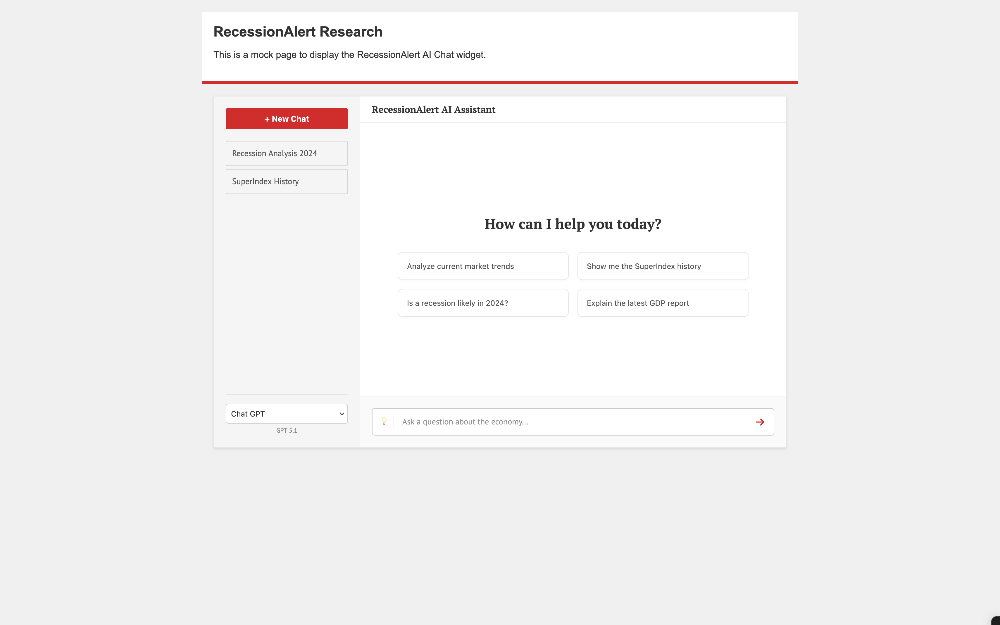
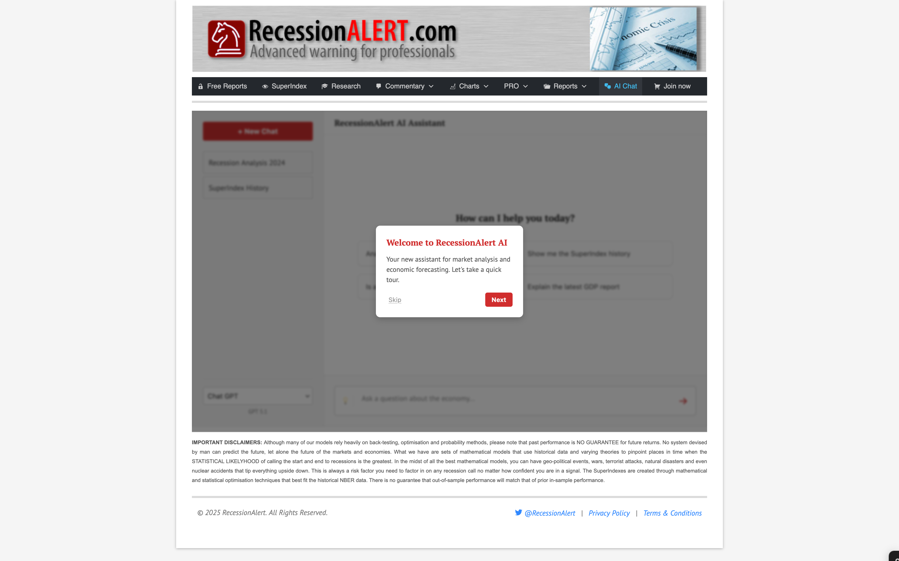
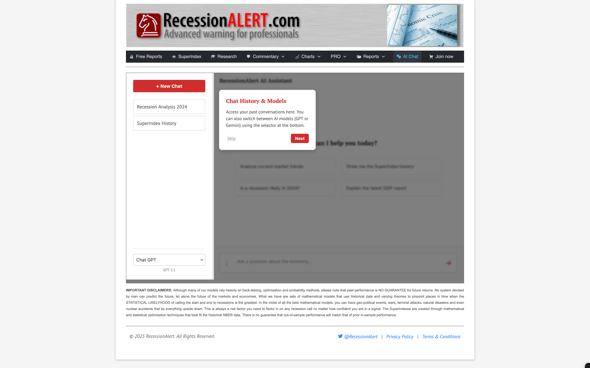
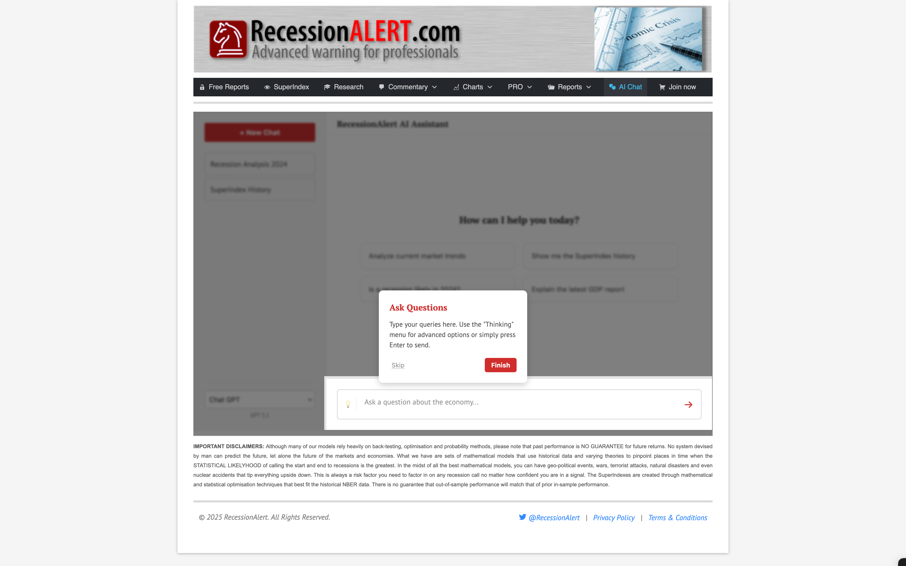
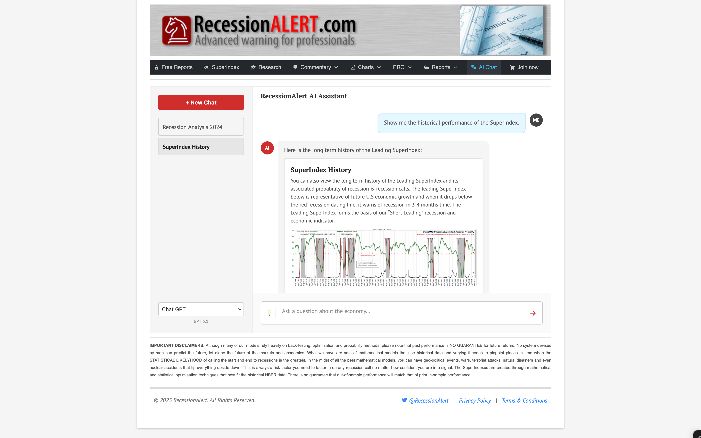

# RecessionAlert AI Chat Widget (Prototype)

A prototype of a drop-in, vanilla JavaScript AI chat interface designed specifically for the RecessionAlert research portal. 
This prototype demonstrates the UI/UX, integration strategy, and value of the proposed "AI Chat" feature.



## 🚀 Overview

The goal of this project is to provide RecessionAlert subscribers with an interactive way to query economic data. Instead of browsing static PDF reports, users can ask questions like *"Show me the SuperIndex history"* and receive instant, chart-backed answers.

**Key Features:**
*   **Zero Dependencies:** Built with plain HTML/CSS/JS. No React, Vue, or build steps required.
*   **Isolated Styling:** Uses namespaced CSS to prevent conflicts with the host WordPress theme.
*   **Rich Media Support:** Renders charts and article summaries directly in the chat stream.
*   **Responsive Design:** Fits a 980px fixed container but adapts internally to available space.

## 📂 Project Structure

```text
ra-chat-prototype/
├── mock-page.html       # Standalone demo page simulating the client environment
├── ra-chat-widget.js    # Core logic (DOM manipulation, state, fake responses)
├── ra-chat-widget.css   # All styles (scoped to #ra-chat-root)
├── assets/              # Images and static resources
└── docs/                # Documentation and screenshots
```

## Prototype Usage

### 1. Local Testing
Download the repo and simply open `mock-page.html` in your web browser. It simulates the host site's header and layout to demonstrate the widget's integration.

### 2. Embedding (Production)
This is an example of how this type of widget can be embedded into any page structure that provides a container.
For production, the intigration would look similar to the following. 

```html
<!-- 1. Container -->
<div id="ra-chat-root"></div>

<!-- 2. Dependencies -->
<link rel="stylesheet" href="path/to/ra-chat-widget.css">
<script src="path/to/ra-chat-widget.js"></script>

<!-- 3. Initialize -->
<script>
  RAChatWidget.init({ containerId: "ra-chat-root" });
</script>
```

## 🎨 Customization

*   **Styling:** All styles are defined in `ra-chat-widget.css` and prefixed with `#ra-chat-root` or `.ra-` to ensure encapsulation.
*   **Data/Responses:** The current prototype uses a static `state` object in `ra-chat-widget.js` to simulate AI responses. This will be replaced by a `fetch()` call to your vector database backend in the live version.

## 📸 Screenshots











## 📄 License
Proprietary - Prepared for RecessionAlert.

